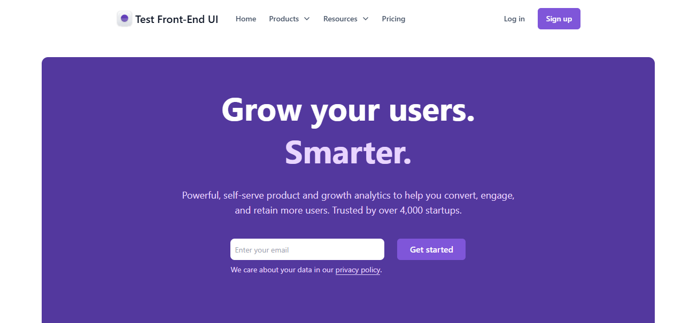
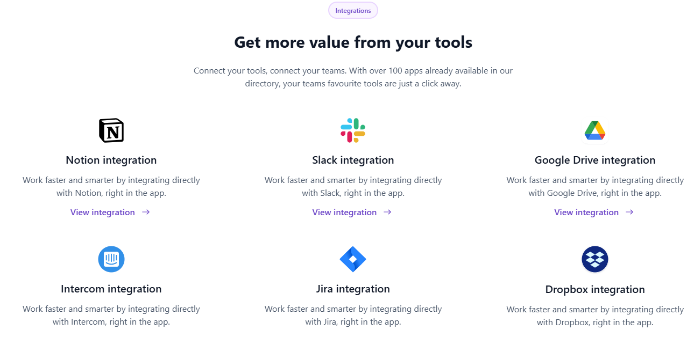
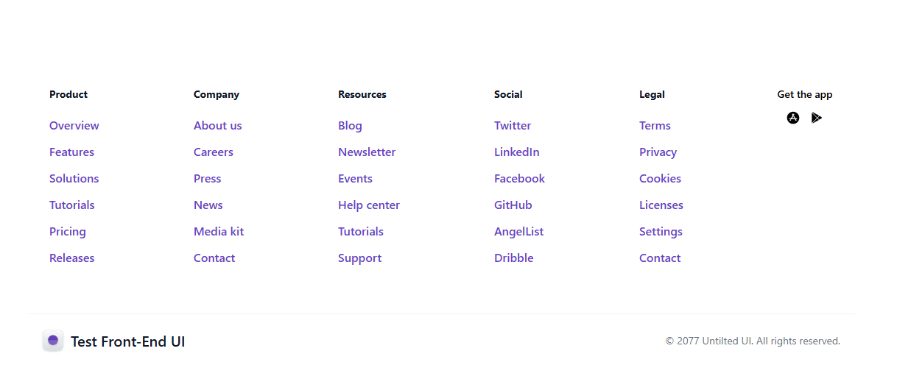

# Prueba Front-End AvilaTek

## Descripción
Este proyecto consiste en replicar un diseño proporcionado en Figma, asegurando que sea completamente responsive. El objetivo principal del proyecto es promocionar un servicio de integraciones con diversas aplicaciones. Cada aplicación es presentada como un producto dentro del proyecto, destacando sus características y beneficios. Además, el proyecto incluye secciones de testimonios de usuarios satisfechos y llamadas a la acción para atraer y convertir a nuevos usuarios. La interfaz ha sido cuidadosamente diseñada para proporcionar una experiencia de usuario intuitiva y atractiva.

## Tecnologías Utilizadas
- **React 19**
- **Next.js 15**
- **Tailwind CSS**
- **TypeScript**

## Librerías Utilizadas
- **Tailwindcss Motion**: para las animaciones.
- **React Icons**: para los íconos.

## Estructura de carpetas
La estructura de carpetas del proyecto está organizada por tipo y características (features) para mantener el código limpio, modular y fácil de mantener.

## Instalación
Para instalar las dependencias del proyecto, ejecuta el siguiente comando: npm install

## Inicializar el proyecto
Después de haber instalado todas las dependencias necesarias del proyecto utilizando npm install, sigue estos pasos para iniciar el servidor de desarrollo:

1- Abre tu terminal: Navega hasta el directorio raíz del proyecto.

2- Ejecuta el siguiente comando para iniciar el servidor de desarrollo: npm run dev

## Despliegue del proyecto y url
Despliegue: Vercel
URL: https://prueba-avila-tek-sepia.vercel.app/

## Vista previa del proyecto

